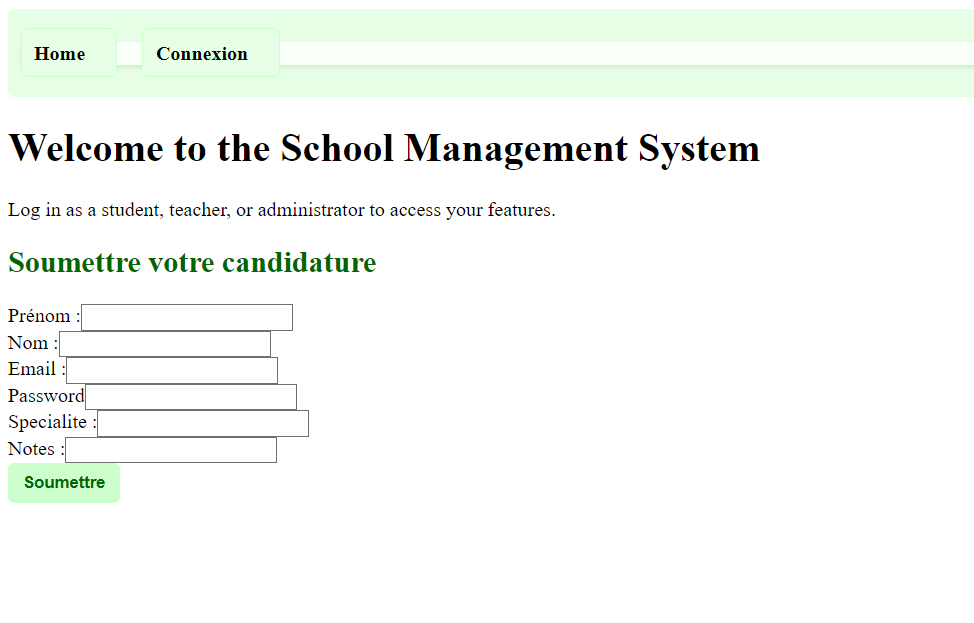
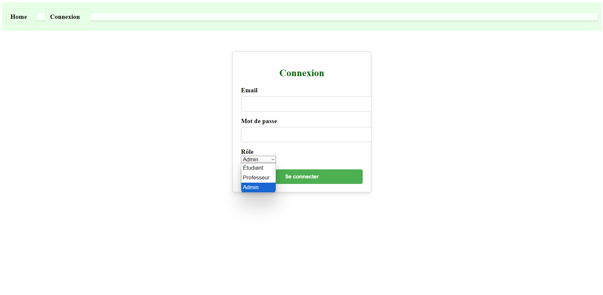
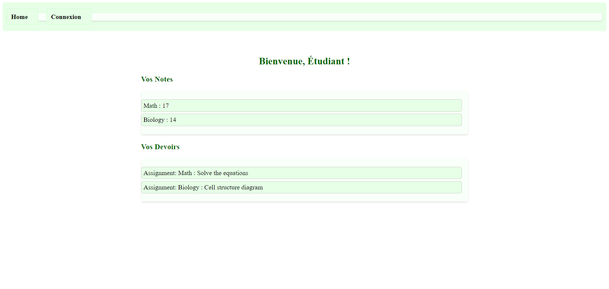
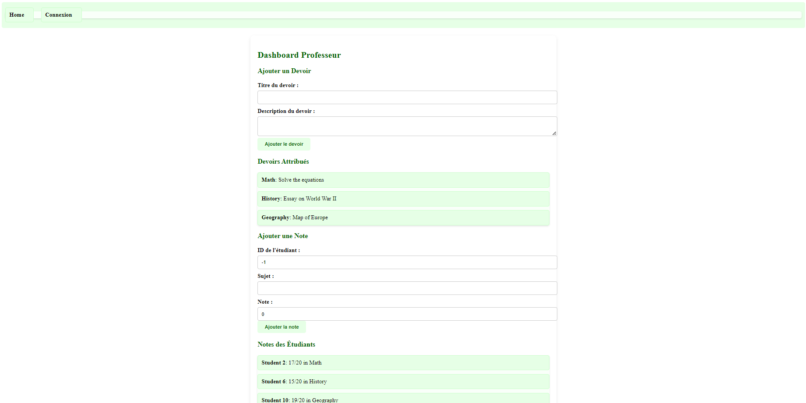
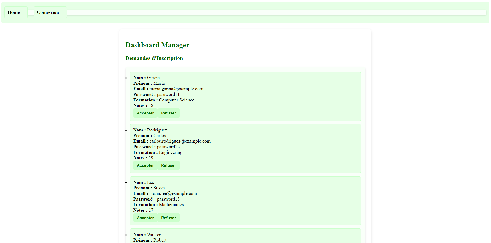
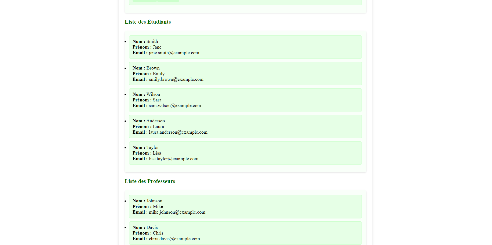

# Website README

## Installation

To run the application, follow these steps:

1. **Backend Setup**:
   Open the terminal and run the following commands:
   cd Backend
   npm start

2. **Frontend Setup**:
   Open a new terminal window and run:
   cd Frontend
   ng serve

3. Once both are running, you can access the website by visiting:
   http://localhost:4200/

---

## Pages Overview

### 1. **Home Page**
The first page you load contains the **navbar** with two buttons:
- **Home**: Takes you back to the home page.
- **Login**: Allows users (teachers, admins, and students) to log in.

Below the navbar, you will find the **admission form** for anyone who wants to register to the school.

### 2. **Login Page**
On the login page, you can choose the type of user you are (Teacher, Admin, or Student) and enter your **email** and **password** to log in.

### 3. **Student Dashboard**
Once logged in as a student, you are redirected to your **dashboard**. Here, you can:
- View your **grades**.
- See the **work** you're tasked with.

### 4. **Teacher Dashboard**
Teachers can access their **dashboard**, where they can:
- **Create tasks** for students.
- Assign **individual grades** using the student ID for privacy and fairness.

### 5. **Admin Dashboard**
Admins have access to a special **dashboard** that allows them to:
- Accept **students** who registered on the home page.
- View lists of **all users**, including **teachers** and **students**.

---